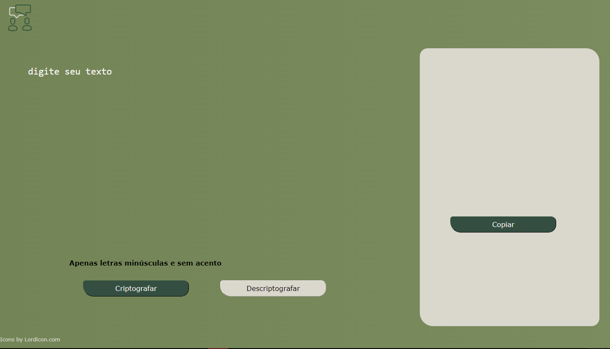
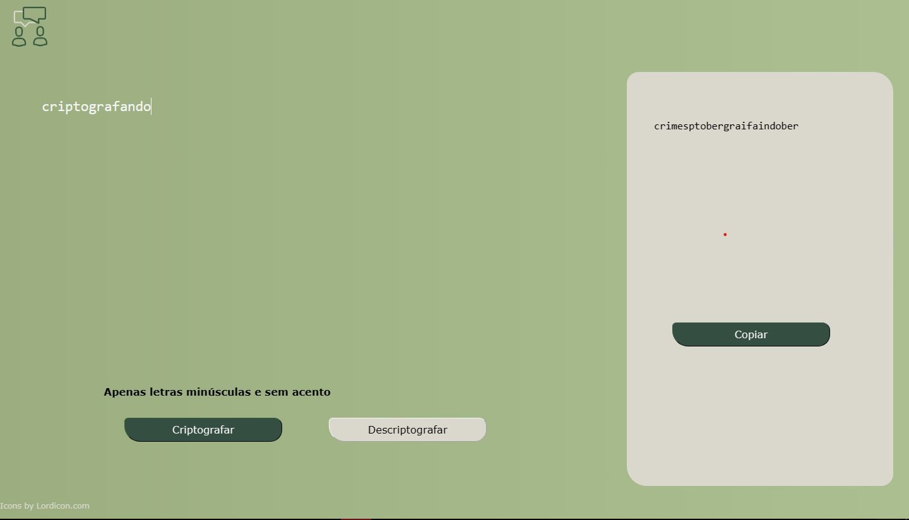
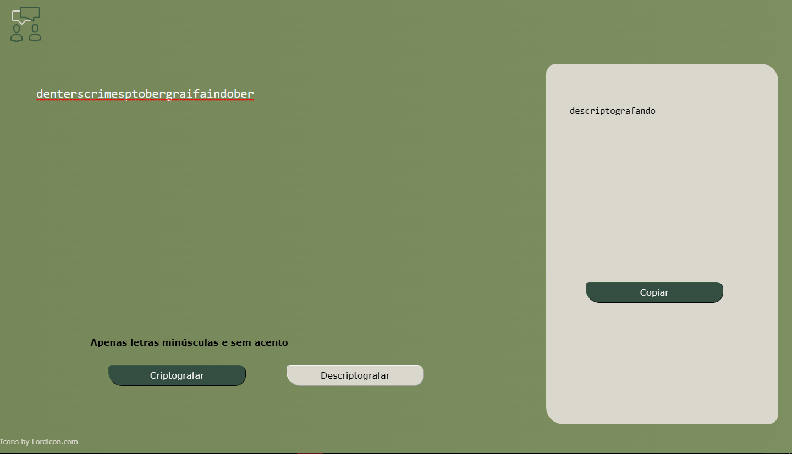

# Challenge ONE Sprint 01:
Construa um decodificador de texto com Javascript

Codifique o texto que quiser, desde que não tenha acentos.

Decodifique os textos que te foram mandados em código usando esta ferramenta.

E copiei os texto com o click de um botão.
